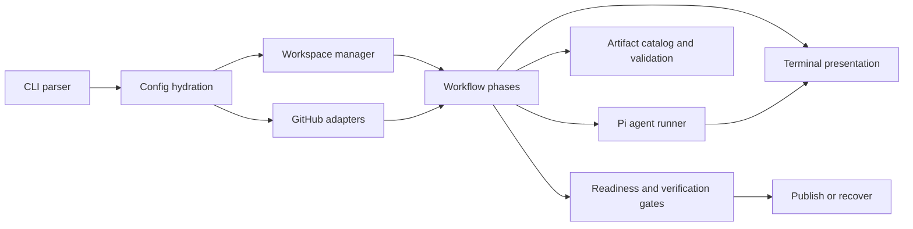

## Distribution boundary

Roark is a versioned CLI package that runs on developer machines, CI runners, and servers. Keep three locations separate: the Roark installation, the target repository's control checkout, and each managed workspace.

Anything required for Roark's built-in behavior must:

- be tracked in this repository
- be included in the published package
- be resolved relative to the installed Roark package
- behave consistently without relying on a particular user's home directory or sibling repositories

Built-in behavior cannot depend on paths such as `~/.agents/skills` or `/Users/<name>/Code/...`. Machine-local resources must be optional and explicitly configured.

## Overview



## Entry point

`roark.ts` is the executable entry point. It parses commands and delegates to library modules.

```bash
bun run roark.ts --help
```

This lists every command.

## CLI layer

The CLI layer handles:

- argument parsing
- config hydration
- interactive preflight behavior
- command dispatch
- local mode behavior

Relevant files live under:

```text
lib/cli/
```

## Autorun layer

The autorun layer owns issue discovery, selection, claiming, branches, attempts, recovery, verification, publishing, and managed workspaces.

Relevant files live under:

```text
lib/autorun/
```

## Workflow layer

Phase artifacts and their validation live under:

```text
lib/workflow/
```

Each agent result has validated JSON and a readable Markdown copy. Roark uses the JSON for workflow decisions and PR bodies.

A shared runner validates and writes each pair. Each phase provides its submission tool, validator, and Markdown formatter; the caller provides the output paths. The runner writes JSON last so an interrupted write cannot appear complete.

Numbered artifacts include fix logs, refinements, and Review A/B cycles.

Review findings store routing in `handling`: `must-fix-current`, `follow-up`, or `suggestion`. External blockers and review-wide limitations use separate fields. Validators require evidence and stable finding IDs, enforce size limits, and reject empty fields.

## Terminal output

Terminal output and title handling live under:

```text
lib/presentation/
```

Workflow code reports the target, phase, pass, artifact, and operation. The presentation layer turns those fields into terminal output, timing, verification summaries, final status, and window titles.

## Pi integration

Roark uses the Pi coding-agent SDK for agent-backed phases.

Relevant files live under:

```text
lib/pi/
```

Workflow agents do not load skills from the host machine.

The React, Next.js, UI, and Convex skills under `skills/` ship with Roark. Roark loads them from the installed package.

The bundled skills are `next-best-practices`, `vercel-react-best-practices`, `vercel-composition-patterns`, `design-system-ui`, `convex-migration-helper`, and `convex-performance-audit`.

## GitHub integration

GitHub operations are isolated behind adapters under:

```text
lib/github/
```

These modules wrap issue, PR, comment, and label operations.

## PR revision layer

PR revision behavior lives under:

```text
lib/pr-revision/
```

This layer fetches PR feedback, classifies it, applies only current required fixes, verifies, commits, pushes, and posts a summary.

## Issue curation layer

Issue curation behavior lives under:

```text
lib/issue-curation/
```

It turns reviewer findings into an issue plan. Only `create-issues --yes` publishes that plan.

## Observability

Observable events and status summaries live under:

```text
lib/observability/
```

Artifacts and event logs record enough detail to inspect a background run after its terminal output is gone.

## Adding a command

When adding a command:

1. Add parser and help text.
2. Add config hydration behavior.
3. Add tests for argument parsing.
4. Implement the command in a focused module.
5. Write artifacts for any durable workflow state.
6. Update [CLI reference](cli-reference.md), [Usage](usage.md), and related docs.

## Adding a workflow phase

When adding a phase:

1. Define the artifact contract.
2. Add catalog and validation behavior.
3. Decide whether the phase is deterministic or agent-backed.
4. Make resume behavior explicit.
5. Include the phase in status and summary output.
6. Update [Artifacts](artifacts.md) and [Concepts](concepts.md).

## Test commands

```bash
bun test
bun run typecheck
```
