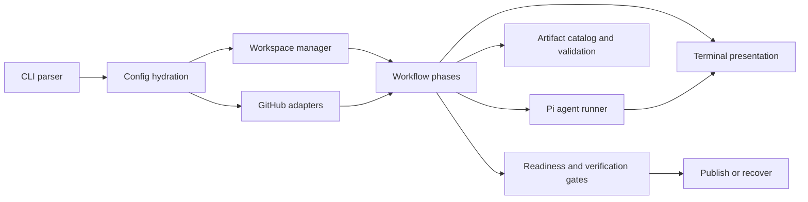

## Distribution Boundary

Roark is a versioned CLI package intended to run across developer machines, CI runners, and servers. Its installation directory, the target repository's control checkout, and a managed workspace are three distinct locations.

Anything required for Roark's built-in behavior must:

- be tracked in this repository
- be included in the published package
- be resolved relative to the installed Roark package
- behave consistently without relying on a particular user's home directory or sibling repositories

Do not make normal behavior depend on absolute paths such as `~/.agents/skills` or `/Users/<name>/Code/...`. Machine-local resources may be supported only as explicit optional user configuration; they cannot define Roark's defaults or required capabilities.

## System Shape



## Entry Point

`roark.ts` is the executable entry point. It parses commands and delegates to library modules.

Use:

```bash
bun run roark.ts --help
```

for the complete runtime command list.

## CLI Layer

The CLI layer is responsible for:

- argument parsing
- config hydration
- interactive preflight behavior
- command dispatch
- local mode behavior

Relevant files live under:

```text
lib/cli/
```

## Autorun Layer

The autorun layer owns issue discovery, selection, claiming, branches, attempts, recovery, verification, publishing, and managed workspaces.

Relevant files live under:

```text
lib/autorun/
```

## Workflow Layer

The workflow layer owns phase artifacts and validation.

Relevant files live under:

```text
lib/workflow/
```

Static artifacts include issue context; canonical triage, implementation-plan, review, readiness, and PR-draft JSON; deterministic Markdown views; implementation and verification logs; metadata; issue curation plans; and issue creation results. Workflow decisions and PR-body updates consume the canonical JSON, never the rendered views.

Agent-produced JSON/Markdown pairs pass through one structured-artifact runner: a phase supplies its schema-bound terminating tool, validator, and Markdown formatter, while the caller supplies the artifact destinations. The runner accepts exactly one tool submission, renders the human view, and writes canonical JSON last so an incomplete pair is never treated as completed workflow state.

Numbered artifacts include fix logs, refinements, and Review A/B cycles.

The review domain model keeps work routing (`must-fix-current`, `follow-up`, or `suggestion`) separate from external constraints and review-wide limitations. Validation trims strings, rejects empty inspection evidence, bounds artifact size/cardinality, requires stable semantic IDs, and ties restart recommendations to specific unblocked findings. Renderers treat submitted strings as plain Markdown content.

## Terminal Presentation

Shared operational output and terminal-title handling live under:

```text
lib/presentation/
```

Workflow code supplies structured target, phase, revision/pass, artifact, and operation context. The presentation layer owns safe line formatting, width/path bounding, phase timing, tool activity, verification summaries, final outcomes, and TTY-gated title sequences. Persistent observability and artifacts remain independent consumers of the same workflow phase identity.

## Pi Integration

Roark uses the Pi coding-agent SDK for agent-backed phases.

Relevant files live under:

```text
lib/pi/
```

Normal workflow agents intentionally avoid ambient machine-local skill discovery. This keeps workflow behavior reproducible across hosts.

Normal workflow agents can dynamically invoke the React, Next.js, UI, and Convex skills bundled under `skills/`. The canonical skill content lives in this repository and ships in the package. Roark loads these skills relative to its installed module location, not from the target repository, the invoking user's home directory, or another checkout. Complete skill directories, including referenced files and required assets, are versioned Roark behavior.

The bundled set is intentionally curated: `next-best-practices`, `vercel-react-best-practices`, `vercel-composition-patterns`, `design-system-ui`, `convex-migration-helper`, and `convex-performance-audit`. Ambient skill discovery remains disabled.

## GitHub Integration

GitHub operations are isolated behind adapters under:

```text
lib/github/
```

These modules wrap issue, PR, comment, and label operations.

## PR Revision Layer

PR revision behavior lives under:

```text
lib/pr-revision/
```

This layer fetches PR feedback, classifies it, applies only current required fixes, verifies, commits, pushes, and posts a summary.

## Issue Curation Layer

Issue curation behavior lives under:

```text
lib/issue-curation/
```

It turns reviewer findings into an approval-friendly plan and publishes only through the approved `create-issues --yes` path.

## Observability

Observable events and status summaries live under:

```text
lib/observability/
```

Artifacts and event logs should make background runs understandable without reading transient terminal output.

## Adding a Command

When adding a command:

1. Add parser and help text.
2. Add config hydration behavior.
3. Add tests for argument parsing.
4. Implement the command in a focused module.
5. Write artifacts for any durable workflow state.
6. Update [CLI reference](cli-reference.md), [Usage](usage.md), and related docs.

## Adding a Workflow Phase

When adding a phase:

1. Define the artifact contract.
2. Add catalog and validation behavior.
3. Decide whether the phase is deterministic or agent-backed.
4. Make resume behavior explicit.
5. Include the phase in status and summary output.
6. Update [Artifacts](artifacts.md) and [Concepts](concepts.md).

## Test Commands

```bash
bun test
bun run typecheck
```

## Next Steps

- Use [Artifacts](artifacts.md) for durable state contracts.
- Use [CLI reference](cli-reference.md) when command behavior changes.
