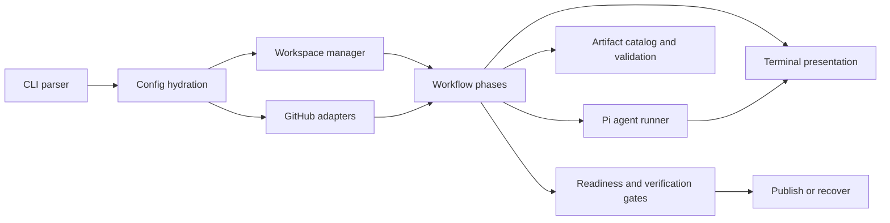

## Distribution boundary

Roark runs as a versioned CLI package on developer machines, CI runners, and servers. A run involves three separate locations:

- the installed Roark package
- the target repository's control checkout
- a managed workspace for each issue or pull request

Anything required for Roark's built-in behavior must:

- be tracked in this repository
- be included in the published package
- be resolved relative to the installed Roark package
- behave consistently without relying on a particular user's home directory or sibling repositories

Built-in behavior cannot depend on paths such as `~/.agents/skills` or `/Users/<name>/Code/...`. Machine-local resources must be optional and explicitly configured.

## Overview



## Code map

`roark.ts` is the executable entry point. It parses commands and delegates to library modules.

```bash
bun run roark.ts --help
```

The command lists every supported subcommand and option.

| Path | What it does |
| --- | --- |
| `roark.ts` | Starts the CLI and delegates commands to library modules. |
| `lib/cli/` | Parses arguments, loads configuration, runs preflight checks, and dispatches commands. |
| `lib/autorun/` | Selects and claims issues, prepares branches and workspaces, runs gates, and opens pull requests. |
| `lib/workflow/` | Defines phase artifacts and validates phase results. |
| `lib/presentation/` | Formats terminal output, elapsed time, status summaries, and window titles. |
| `lib/pi/` | Runs agent-backed phases through the Pi coding-agent SDK. |
| `lib/github/` | Reads and changes GitHub issues, labels, comments, branches, and pull requests. |
| `lib/pr-revision/` | Classifies pull request feedback, applies required fixes, verifies, commits, and pushes revisions. |
| `lib/issue-curation/` | Converts reviewer findings into an issue plan. Only `create-issues --yes` publishes the plan. |
| `lib/observability/` | Records events and status summaries for later inspection. |

## Workflow artifacts

Each agent result has validated JSON and a readable Markdown copy. Roark uses the JSON for workflow decisions and PR bodies.

Each phase supplies a submission tool, validator, and Markdown formatter. The caller chooses the output paths. A shared runner validates the result and writes the Markdown copy before the JSON file. If the process stops between those writes, the missing JSON marks the phase as incomplete.

Numbered artifacts include fix logs, refinements, and Review A/B cycles.

Each review finding records one `handling` value: `must-fix-current`, `follow-up`, or `suggestion`. Separate fields record external blockers and limits that affect the entire review. Validators require evidence and stable finding IDs. They also enforce size limits and reject empty fields.

Workflow code reports the target, phase, pass, artifact, and operation to `lib/presentation/`. That module formats the terminal output, timing, verification summary, final status, and window title.

## Bundled skills

Roark uses the Pi coding-agent SDK for agent-backed phases.

Workflow agents do not load skills from the host machine.

The React, Next.js, UI, and Convex skills under `skills/` ship with Roark. Roark loads them from the installed package.

The bundled skills are `next-best-practices`, `vercel-react-best-practices`, `vercel-composition-patterns`, `design-system-ui`, `convex-migration-helper`, and `convex-performance-audit`.

Artifacts and event logs preserve the state needed to inspect a background run after its terminal output is gone.

## Adding a command

When adding a command:

1. Add parser and help text.
2. Add config hydration behavior.
3. Add tests for argument parsing.
4. Implement the command in a focused module.
5. Write artifacts for any durable workflow state.
6. Update [CLI reference](cli-reference.md), [Usage](usage.md), and related docs.

## Adding a workflow phase

When adding a phase:

1. Define the artifact contract.
2. Add catalog and validation behavior.
3. Decide whether the phase is deterministic or agent-backed.
4. Make resume behavior explicit.
5. Include the phase in status and summary output.
6. Update [Artifacts](artifacts.md) and [Concepts](concepts.md).

## Test commands

```bash
bun test
bun run typecheck
```
