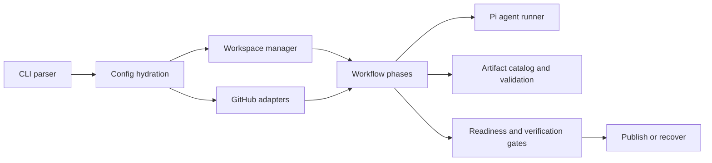

## System Shape



## Entry Point

`roark.ts` is the executable entry point. It parses commands and delegates to library modules.

Use:

```bash
bun run roark.ts --help
```

for the complete runtime command list.

## CLI Layer

The CLI layer is responsible for:

- argument parsing
- config hydration
- interactive preflight behavior
- command dispatch
- local mode behavior

Relevant files live under:

```text
lib/cli/
```

## Autorun Layer

The autorun layer owns issue discovery, selection, claiming, branches, attempts, recovery, verification, publishing, and managed workspaces.

Relevant files live under:

```text
lib/autorun/
```

## Workflow Layer

The workflow layer owns phase artifacts and validation.

Relevant files live under:

```text
lib/workflow/
```

Static artifacts include issue, triage, implementation plan, implementation log, reviews, readiness, verification, metadata, issue curation plan, and issue creation results.

Numbered artifacts include fix logs and final reviews.

## Pi Integration

Roark uses the Pi coding-agent SDK for agent-backed phases.

Relevant files live under:

```text
lib/pi/
```

Normal workflow agents intentionally avoid ambient machine-local skill discovery. This keeps workflow behavior reproducible across hosts.

## GitHub Integration

GitHub operations are isolated behind adapters under:

```text
lib/github/
```

These modules wrap issue, PR, comment, and label operations.

## PR Revision Layer

PR revision behavior lives under:

```text
lib/pr-revision/
```

This layer fetches PR feedback, classifies it, applies only current required fixes, verifies, commits, pushes, and posts a summary.

## Issue Curation Layer

Issue curation behavior lives under:

```text
lib/issue-curation/
```

It turns reviewer findings into an approval-friendly plan and publishes only through the approved `create-issues --yes` path.

## Observability

Observable events and status summaries live under:

```text
lib/observability/
```

Artifacts and event logs should make background runs understandable without reading transient terminal output.

## Adding a Command

When adding a command:

1. Add parser and help text.
2. Add config hydration behavior.
3. Add tests for argument parsing.
4. Implement the command in a focused module.
5. Write artifacts for any durable workflow state.
6. Update [CLI reference](cli-reference.md), [Usage](usage.md), and related docs.

## Adding a Workflow Phase

When adding a phase:

1. Define the artifact contract.
2. Add catalog and validation behavior.
3. Decide whether the phase is deterministic or agent-backed.
4. Make resume behavior explicit.
5. Include the phase in status and summary output.
6. Update [Artifacts](artifacts.md) and [Concepts](concepts.md).

## Test Commands

```bash
bun test
bun run typecheck
```

## Next Steps

- Use [Workflow skills](workflow-skills.md) for skill resolution details.
- Use [Artifacts](artifacts.md) for durable state contracts.
- Use [CLI reference](cli-reference.md) when command behavior changes.
