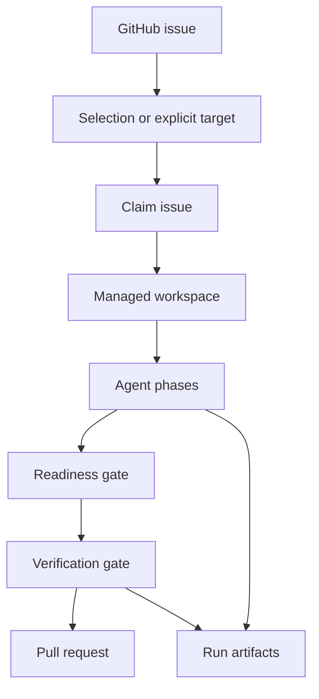
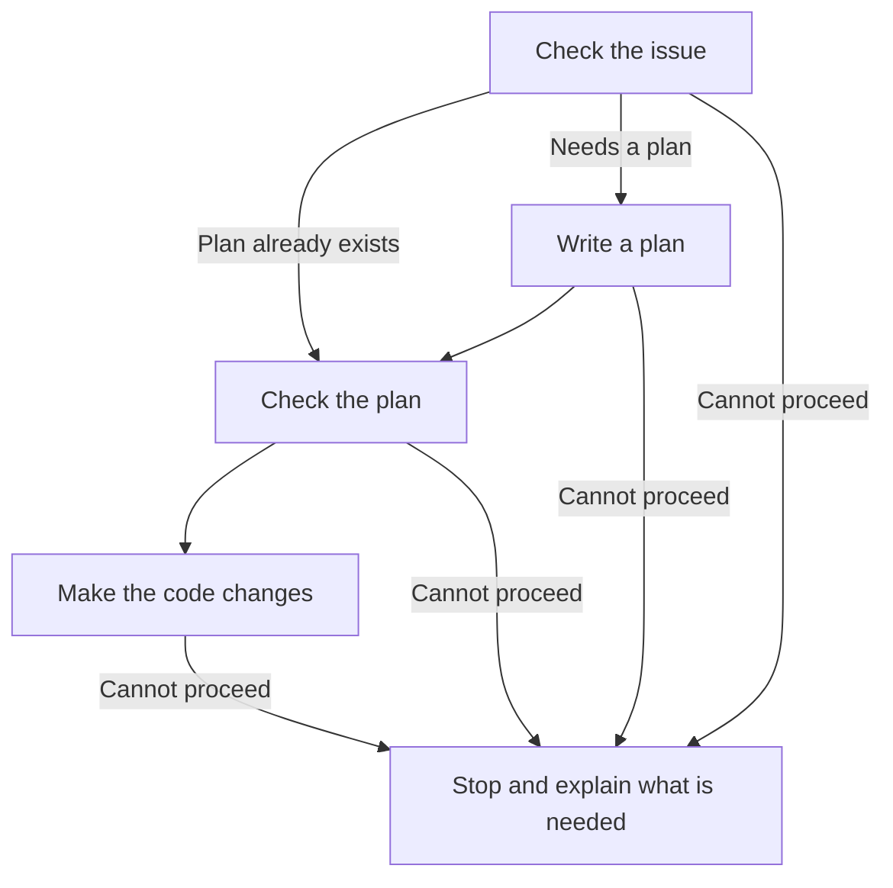

## How a run works



## Control checkout

The control checkout is the repository directory where you invoke `roark`.

Roark reads `.roark/config.json` and writes `.roark/runs` in this checkout. Ignored files copied into managed workspaces also come from here.

The control checkout should stay clean and should not be shared by humans while scheduled Roark jobs are running.

## Managed workspace

A managed workspace is an isolated clone where Roark lets the agent modify files.

Default layout:

```text
~/.roark/workspaces/<owner>-<repo>/issue-<number>
```

Each issue gets a persistent workspace so failed uncommitted work can be inspected and recovered.

## Issue branch

Roark creates or reuses an issue branch named:

```text
roark/issue-<number>
```

Publishing pushes this branch and opens a pull request against the configured base branch.

## Attempt

An attempt is one Roark run for one issue.

Attempts are stored under:

```text
.roark/runs/issue/<issue-number>/attempts/<attempt-number>/
```

`roark continue` reads the saved reports, managed workspace, and current issue discussion to decide where work should resume. `roark continue <issue> --restart` starts over from the saved baseline and reads the current discussion too.

## Phase

A phase is one workflow step, such as `fetch`, `triage`, `plan`, `implement`, `review`, `fix`, or `readiness`.

Standalone phase commands are useful for debugging, but most users should prefer `roark do`, `roark auto`, or `roark continue`.

## From the issue to implementation

Roark begins by reading the issue and checking the relevant code. This triage step establishes what needs to change, whether it is already implemented, and whether anything prevents work from starting. Questions that affect that decision are investigated using the code, tests, earlier discussions, and relevant technical documentation.

When the issue includes a plan, Roark checks it against the repository and keeps its agreed decisions, detailed instructions, and required ordering. It records any necessary technical adjustments, such as updating a path after a file has moved. If the issue still needs a plan, Roark drafts one and checks it before implementation.



For example, Roark can investigate how login sessions expire by reading the code and library documentation. If a change requires choosing whether to sign out existing users, it looks for that requirement in the issue and project guidance. If those sources do not settle the choice and the issue does not leave it to Roark, it stops and asks for a decision.

A run can also stop because essential information cannot be confirmed, access is missing, or another issue must be completed first. These problems can surface during triage, planning, or implementation. The report explains what remains unresolved and what would allow work to continue.

## The two reviews

Roark runs two reviews:

- Spec and Correctness: did we build the right behavior correctly?
- Standards and Maintainability: did we build it in a way that fits the repository?

A change must pass both.

Each finding has a `handling` value: fix now, follow up later, or optional suggestion. `blockedBy` records missing access, information, dependencies, or decisions. Roark fixes unblocked current work before stopping.

Reviews record what was inspected and anything that limited the review. A finding keeps the same ID until the problem is resolved.

## Readiness gate

The readiness gate passes only when `readiness.json` has `"status": "ready-for-pr"`. `readiness.md` is the readable copy.

## Verification gate

The verification gate runs the configured shell command, such as `bun run check`.

The run can publish only when the command exits `0`. Command output is recorded in `verification.md`.

## Labels

Labels control autorun eligibility and record the issue's workflow state. By default, `ready-for-agent` opts an issue into autorun and any configured skip label excludes it.

See [Label semantics](label-semantics.md) for the default skip labels and every lifecycle transition.

## Pull requests

Roark opens a pull request after readiness and verification pass. Autorun then posts correctness and maintainability reviews. If that review fails or becomes stale, the PR stays open.

Roark does not:

- merge pull requests
- close issues
- make final review decisions

## Run artifacts

Artifacts are durable files that explain what happened and support recovery. They are also the easiest place to debug failed runs.

Start with [Artifacts](artifacts.md), then use [Troubleshooting](troubleshooting.md) for common failures.
