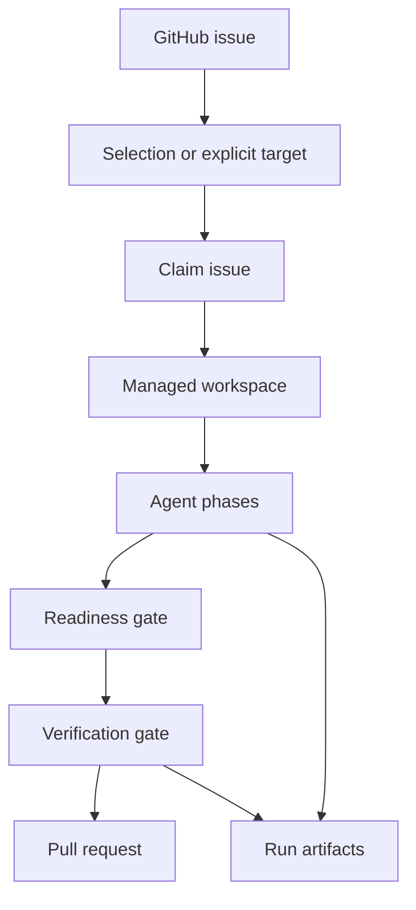

## How a run works



## Control checkout

The control checkout is the repository directory where you invoke `roark`.

Roark reads `.roark/config.json` from this checkout, writes run artifacts under `.roark/runs`, and uses it as the source for ignored local files copied into managed workspaces.

The control checkout should stay clean and should not be shared by humans while scheduled Roark jobs are running.

## Managed workspace

A managed workspace is an isolated clone where Roark lets the agent modify files.

Default layout:

```text
~/.roark/workspaces/<owner>-<repo>/issue-<number>
```

Each issue gets a persistent workspace so failed uncommitted work can be inspected and recovered.

## Issue branch

Roark creates or reuses an issue branch named:

```text
roark/issue-<number>
```

Publishing pushes this branch and opens a pull request against the configured base branch.

## Attempt

An attempt is one Roark run for one issue.

Attempts are stored under:

```text
.roark/runs/issue/<issue-number>/attempts/<attempt-number>/
```

`roark continue` resumes an attempt by reading this artifact directory and the persistent managed workspace.

## Phase

A phase is one workflow step, such as `fetch`, `triage`, `plan`, `implement`, `review`, `fix`, or `readiness`.

Standalone phase commands are useful for debugging, but most users should prefer `roark do`, `roark auto`, or `roark continue`.

## The two reviews

Roark runs two reviews:

- Spec and Correctness: did we build the right behavior correctly?
- Standards and Maintainability: did we build it in a way that fits the repository?

A change must pass both.

Each finding has a `handling` value: fix it now, create a follow-up, or treat it as an optional suggestion. A separate `blockedBy` field records missing access, information, dependencies, or human decisions. Roark still fixes any unblocked current work before it stops.

Reviews also record what was inspected and anything that prevented a complete review. Finding IDs stay the same across passes while the underlying problem remains.

## Readiness gate

The readiness gate passes only when `readiness.json` has `"status": "ready-for-pr"`. `readiness.md` is the readable copy.

## Verification gate

The verification gate runs the configured shell command, such as `bun run check`.

The run can publish only when the command exits `0`. Command output is recorded in `verification.md`.

## Labels

Labels control autorun eligibility and lifecycle state.

The default ready label is `ready-for-agent`. Default workflow skip labels include `needs-triage`, `blocked`, `needs-human`, `triage-rejected`, `wont-fix`, `agent-in-progress`, `agent-failed`, and `agent-pr-opened`.

See [Label semantics](label-semantics.md).

## Pull requests

Roark opens a pull request only after readiness and verification pass. Autorun then runs `review-pr` against that PR and posts both reviews. A failed or stale review does not undo the published PR.

Roark does not:

- merge pull requests
- close issues
- make final review decisions

## Run artifacts

Artifacts are durable files that explain what happened and support recovery. They are also the easiest place to debug failed runs.

Start with [Artifacts](artifacts.md), then use [Troubleshooting](troubleshooting.md) for common failures.
