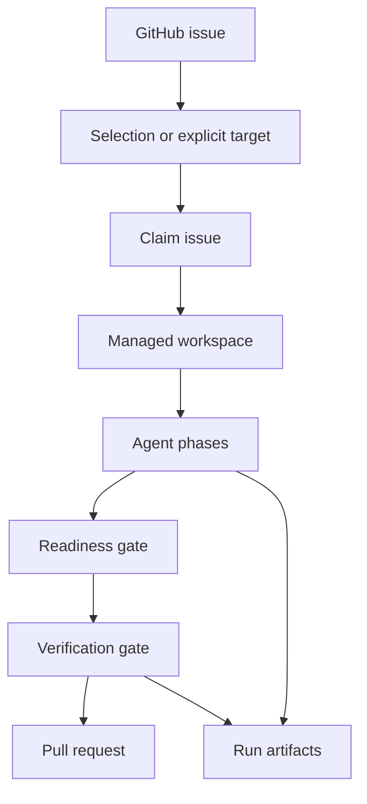

## Mental Model



## Control Checkout

The control checkout is the repository directory where you invoke `roark`.

Roark reads `.roark/config.json` from this checkout, writes run artifacts under `.roark/runs`, and uses it as the source for ignored local files copied into managed workspaces.

The control checkout should stay clean and should not be shared by humans while scheduled Roark jobs are running.

## Managed Workspace

A managed workspace is an isolated clone where Roark lets the agent modify files.

Default layout:

```text
~/.roark/workspaces/<owner>-<repo>/issue-<number>
```

Each issue gets a persistent workspace so failed uncommitted work can be inspected and recovered.

## Issue Branch

Roark creates or reuses an issue branch named:

```text
roark/issue-<number>
```

Publishing pushes this branch and opens a pull request against the configured base branch.

## Attempt

An attempt is one Roark run for one issue.

Attempts are stored under:

```text
.roark/runs/issue/<issue-number>/attempts/<attempt-number>/
```

`roark continue` resumes an attempt by reading this artifact directory and the persistent managed workspace.

## Phase

A phase is one workflow step, such as `fetch`, `triage`, `plan`, `implement`, `review`, `fix`, or `readiness`.

Standalone phase commands are useful for debugging, but most users should prefer `roark do`, `roark auto`, or `roark continue`.

## Readiness Gate

The readiness gate checks Roark's final readiness artifact. The run can publish only when `readiness.md` declares:

```text
ready-for-pr
```

This gate prevents publishing when the agent workflow itself reports unresolved blockers.

## Verification Gate

The verification gate runs the configured shell command, such as `bun run check`.

The run can publish only when the command exits `0`. Command output is recorded in `verification.md`.

## Labels

Labels control autorun eligibility and lifecycle state.

The default ready label is `afk`. Default skip and lifecycle labels include `blocked`, `needs-human`, `roark-in-progress`, `roark-failed`, and `roark-pr-opened`.

See [Label semantics](label-semantics.md).

## Pull Requests

Roark opens pull requests only after readiness and verification pass.

Roark does not:

- merge pull requests
- close issues
- make final review decisions

## Run Artifacts

Artifacts are durable files that explain what happened and support recovery. They are also the easiest place to debug failed runs.

Start with [Artifacts](artifacts.md), then use [Troubleshooting](troubleshooting.md) for common failures.

## Next Steps

- Use [Quickstart](quickstart.md) for the first successful run.
- Use [Usage](usage.md) for command selection.
- Use [Architecture](architecture.md) for contributor-level internals.
