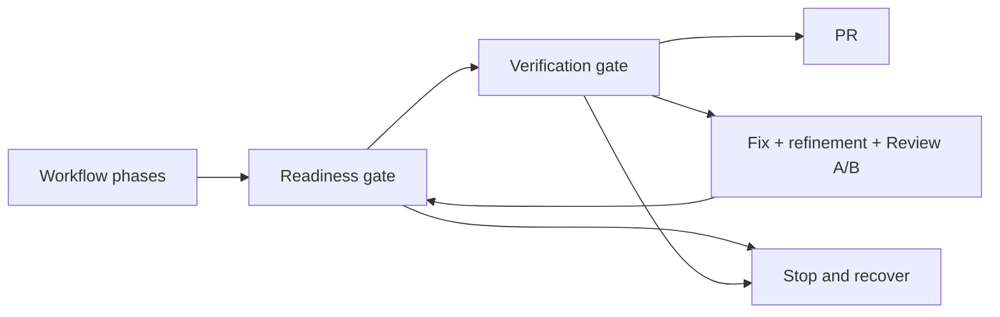

## Gate order



## Configure verification

Use `--verify`:

```bash
roark auto --repo owner/repo --verify "bun run check"
```

Or set top-level `verify` in `.roark/config.json`:

```json
{
  "verify": "bun run check"
}
```

For `auto` and `continue`, Roark requires a verification command. It uses CLI flag, then config, then inference from `package.json` or `Makefile`.

## Readiness gate

The readiness gate passes only when `readiness.json` has `"status": "ready-for-pr"`. Missing or invalid JSON fails the gate. `readiness.md` is the readable copy.

Readiness answers whether the workflow believes the change is ready to publish.

## Verification gate

Roark runs the verification command through `sh -c` in the issue workspace. Exit code `0` passes.

If verification fails and the fix budget is not exhausted, Roark saves the failure, runs another fix and review pass, checks readiness again, and reruns verification. It does not rerun the initial implementation phase.

The command, exit code, stdout tail, and stderr tail are written to:

```text
.roark/runs/issue/<n>/attempts/<k>/verification.md
```

Full stdout and stderr are stored at:

```text
.roark/runs/issue/<n>/attempts/<k>/verification-full.md
```

Before a verification-driven fix pass, Roark archives both the output tail and full output:

```text
.roark/runs/issue/<n>/attempts/<k>/verification-before-fix-<pass>.md
.roark/runs/issue/<n>/attempts/<k>/verification-before-fix-<pass>-full.md
```

PR revisions use the same filenames in their revision directory.

## Example commands

| Stack | Example |
| --- | --- |
| Bun | `{ "verify": "bun run check" }` |
| Bun tests only | `{ "verify": "bun test" }` |
| npm | `{ "verify": "npm test" }` |
| pnpm | `{ "verify": "pnpm test" }` |
| Makefile | `{ "verify": "make test" }` |
| Python | `{ "verify": "pytest" }` |
| Go | `{ "verify": "go test ./..." }` |
| Rust | `{ "verify": "cargo test" }` |
| TypeScript | `{ "verify": "npx tsc --noEmit" }` |

Prefer a command that is deterministic and non-interactive. A fast repository check is usually better than an expensive full deployment pipeline for local Roark publishing.

## Hooks before verification

If verification needs setup immediately before running, use `hooks.beforeVerify`:

```json
{
  "hooks": {
    "beforeVerify": "bun install --frozen-lockfile"
  }
}
```

See [Lifecycle hooks](lifecycle-hooks.md).

## Ignored local files

If verification needs ignored local files, configure `workspace.copyToWorktree`:

```json
{
  "workspace": {
    "copyToWorktree": [".secrets/env"]
  }
}
```

Store path names in config, not secret values. See [Managed workspaces](managed-workspaces.md) and [Security and secrets](security-and-secrets.md).

## Recover from failure

If automatic repair stops, the fix budget is exhausted or the failure needs a setup change.

1. Open `verification.md` and any `verification-before-fix-*.md` artifacts.
2. Fix missing host setup, ignored files, hooks, or code issues.
3. Run `roark continue`.

```bash
roark continue 123 --repo owner/repo
```
