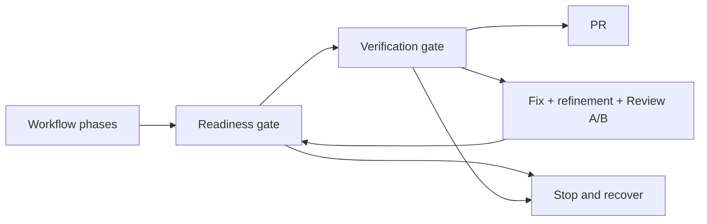

## Gate Order



## Configure Verification

Use `--verify`:

```bash
roark auto --repo owner/repo --verify "bun run check"
```

Or set top-level `verify` in `.roark/config.json`:

```json
{
  "verify": "bun run check"
}
```

For `auto` and `continue`, Roark requires a verification command. It uses CLI flag, then config, then inference from `package.json` or `Makefile`.

## Readiness Gate

The workflow's validated `readiness.json` decision must have status exactly:

```text
ready-for-pr
```

Anything else—or invalid/missing JSON—fails the readiness gate. `readiness.md` is the human-readable rendering and is not gate input.

Readiness answers whether the workflow believes the change is ready to publish.

## Verification Gate

Roark runs the verification command through `sh -c` in the issue workspace. Exit code `0` passes.

Verification answers whether the repository checks actually pass. A non-zero exit code is repairable while `maxFixPasses` has remaining budget: Roark archives the failure, runs the next fix pass, refines the result, runs the corresponding numbered Review A/B cycle, recomputes readiness, and then reruns verification. It does not rerun the initial implementation phase solely for verification repair.

The command, exit code, stdout tail, and stderr tail are written to:

```text
.roark/runs/issue/<n>/attempts/<k>/verification.md
```

The complete stdout and stderr are retained separately at:

```text
.roark/runs/issue/<n>/attempts/<k>/verification-full.md
```

Before each verification-driven fix pass, the failed output tail and its complete companion are archived as:

```text
.roark/runs/issue/<n>/attempts/<k>/verification-before-fix-<pass>.md
.roark/runs/issue/<n>/attempts/<k>/verification-before-fix-<pass>-full.md
```

PR revision generations use the same bounded and full companion filenames in their revision artifact directory.

## Common Commands

| Stack | Example |
| --- | --- |
| Bun | `{ "verify": "bun run check" }` |
| Bun tests only | `{ "verify": "bun test" }` |
| npm | `{ "verify": "npm test" }` |
| pnpm | `{ "verify": "pnpm test" }` |
| Makefile | `{ "verify": "make test" }` |
| Python | `{ "verify": "pytest" }` |
| Go | `{ "verify": "go test ./..." }` |
| Rust | `{ "verify": "cargo test" }` |
| TypeScript | `{ "verify": "npx tsc --noEmit" }` |

Prefer a command that is deterministic and non-interactive. A fast repository check is usually better than an expensive full deployment pipeline for local Roark publishing.

## Hooks Before Verification

If verification needs setup immediately before running, use `hooks.beforeVerify`:

```json
{
  "hooks": {
    "beforeVerify": "bun install --frozen-lockfile"
  }
}
```

See [Lifecycle hooks](lifecycle-hooks.md).

## Ignored Local Files

If verification needs ignored local files, configure `workspace.copyToWorktree`:

```json
{
  "workspace": {
    "copyToWorktree": [".secrets/env"]
  }
}
```

Store path names in config, not secret values. See [Managed workspaces](managed-workspaces.md) and [Security and secrets](security-and-secrets.md).

## Failure Recovery

When verification fails and fix budget remains, Roark normally repairs it automatically through the fix/refinement/Review A/B loop. If it stops, then either the fix budget is exhausted or the failure looks like setup/tooling rather than a local code issue.

1. Open `verification.md` and any `verification-before-fix-*.md` artifacts.
2. Fix missing host setup, ignored files, hooks, or code issues.
3. Run `roark continue`.

```bash
roark continue 123 --repo owner/repo
```

## Next Steps

- Use [Troubleshooting](troubleshooting.md#verification-command-missing) for common verification failures.
- Use [Configuration](configuration.md) for the `verify` key.
- Use [Operations runbook](operations-runbook.md) before scheduling verification-heavy runs.
